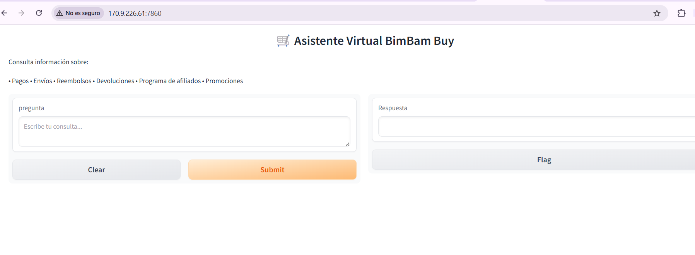

# ChallengeAluraAgente

Challenge Agente - Implementación de un Agente RAG (Retrieval-Augmented Generation)

## 📋 Descripción

Este proyecto implementa un **Agente RAG (Retrieval-Augmented Generation)** que combina técnicas de recuperación de información con generación de texto basada en modelos de lenguaje. El agente [...]

## 🎯 Objetivo

El objetivo principal es crear un sistema inteligente que pueda:
- Recuperar información de múltiples fuentes
- Procesar y comprender consultas del usuario
- Generar respuestas precisas y relevantes basadas en el contexto recuperado

## 🛠️ Tecnologías Utilizadas

- **Python 3**: Lenguaje de programación
- **Jupyter Notebook**: Entorno interactivo para desarrollo
- **Sentence Transformers**: Para embeddings semánticos
- **LLM (Language Model)**: Modelos de lenguaje para generación de texto
- **Google Colab**: Plataforma de ejecución

## 📁 Estructura del Proyecto

```
ChallengeAluraAgente/
├── Agente_RAG.ipynb          # Notebook principal del agente RAG
├── README.md                  # Este archivo
└── ...
```

## 🚀 Cómo Usar

### Requisitos Previos

- Acceso a Google Colab o un entorno Jupyter local
- Conexión a internet para descargar modelos
- Librerías Python necesarias (instaladas automáticamente en el notebook)

### Instalación

1. Abre el notebook `Agente_RAG.ipynb` en Google Colab:
   - Ve a [Google Colab](https://colab.research.google.com)
   - Selecciona "Abrir archivo" y carga el notebook

2. O ejecuta localmente:
   ```bash
   jupyter notebook Agente_RAG.ipynb
   ```

### Ejecución

1. Ejecuta las celdas del notebook en orden
2. Sigue las instrucciones en cada sección
3. Proporciona tus consultas al agente cuando se solicite

## 📚 Componentes Principales

### 1. **Carga de Modelos**
   - Descarga automática de `sentence-transformers`
   - Configuración de modelos de embeddings

### 2. **Procesamiento de Documentos**
   - Lectura y procesamiento de documentos fuente
   - Generación de embeddings semánticos

### 3. **Motor de Búsqueda**
   - Recuperación de documentos relevantes
   - Ranking por similaridad

### 4. **Generación de Respuestas**
   - Integración con modelos de lenguaje
   - Generación de respuestas contextualizadas

## 🏗️ Arquitectura del Sistema

```
┌─────────────────────────────────────────────────────────────┐
│                      ENTRADA DEL USUARIO                    │
│                    (Consulta/Pregunta)                      │
└────────────────────────────┬────────────────────────────────┘
                             │
                             ▼
                    ┌─────────────────┐
                    │  PROCESAMIENTO  │
                    │  DE CONSULTA    │
                    └────────┬────────┘
                             │
                ┌────────────┴────────────┐
                ▼                         ▼
        ┌─────────────────┐      ┌──────────────────┐
        │  GENERADOR DE   │      │  BASE DE DATOS   │
        │  EMBEDDINGS     │      │  DE DOCUMENTOS   │
        │  (Consulta)     │      │  (Pre-procesada) │
        └────────┬────────┘      └────────┬─────────┘
                 │                        │
                 │     ┌──────────────────┘
                 │     ▼
                 │  ┌────────────────────────┐
                 │  │  BÚSQUEDA SEMÁNTICA    │
                 │  │  (Similaridad Vector)  │
                 │  └───────────┬────────────┘
                 │              │
                 └──────┬───────┘
                        │
                        ▼
              ┌──────────────────────┐
              │  DOCUMENTOS RELEVANTES│
              │  (Top-K Recuperados) │
              └──────────┬───────────┘
                        │
                        ▼
              ┌──────────────────────┐
              │   AGENTE LLM         │
              │   (Generador)        │
              │  + CONTEXTO          │
              └──────────┬───────────┘
                        │
                        ▼
              ┌──────────────────────┐
              │   RESPUESTA FINAL    │
              │   CONTEXTUALIZADA    │
              └──────────────────────┘
```

### Flujo de Procesamiento:

1. **Entrada**: Usuario proporciona una consulta
2. **Embedding de Consulta**: La consulta se convierte en un vector semántico
3. **Búsqueda**: Se buscan documentos similares en la base de datos
4. **Recuperación**: Se obtienen los documentos más relevantes
5. **Contexto**: Se combina la consulta con los documentos recuperados
6. **Generación**: El LLM genera una respuesta basada en el contexto
7. **Salida**: Se devuelve la respuesta al usuario

## 💡 Características

- ✅ Recuperación semántica de información
- ✅ Generación de respuestas inteligentes
- ✅ Interfaz interactiva
- ✅ Soporte para múltiples fuentes de datos
- ✅ Embeddings de alta calidad

## 📝 Despliegue en OCI

El despliegue permitió ejecutar el agente RAG en la nube y acceder a la solución mediante un navegador web.

Ruta actual: http://170.9.226.61:7860/

<p align="center">
  
</p>

## 🔗 Referencias

- [Sentence Transformers](https://www.sbert.net/)
- [Retrieval-Augmented Generation](https://arxiv.org/abs/2005.11401)
- [Google Colab Documentation](https://colab.research.google.com)

## 👤 Autor

Este proyecto es parte del challenge de Alura.

## 📄 Licencia

Especifica la licencia de tu proyecto (ej: MIT, Apache 2.0, etc.)

---

**Última actualización**: Julio 2026
